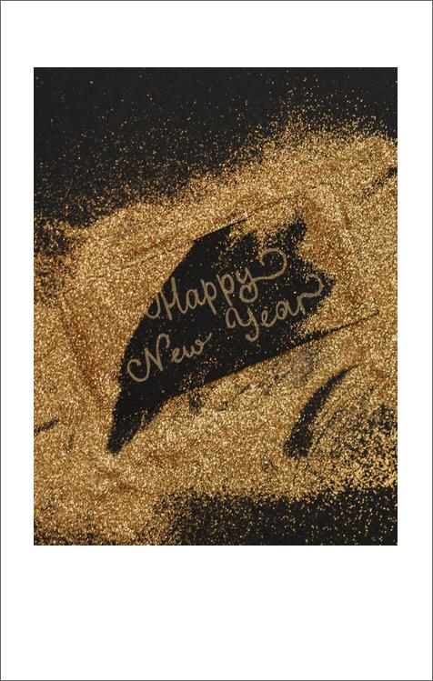
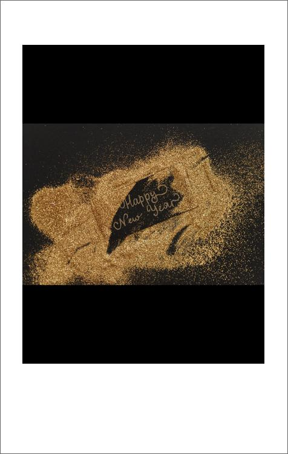
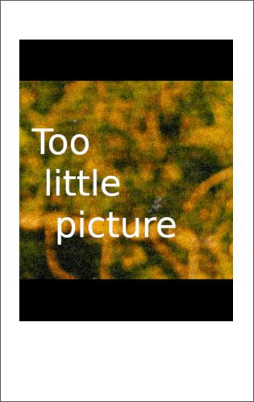

Convert picture into polaroid

# Install

requires python >= 3.9

```
pip install -r requirement.

python polaroid.py --help
```


# Demo

```
python polaroid.py --from examples --to examples-after --final-width 400
```





```
python polaroid.py --from examples --to examples-after-no-crop --final-width 400 --no-crop
```




