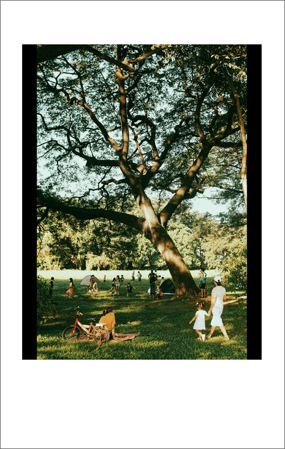

Convert picture into polaroid

# Install

requires python >= 3.9

```
pip install -r requirement.

python polaroid.py --help
```

# Run

```
python polaroid.py --from examples --to examples-after
```

# Demo





```
python polaroid.py --from examples --to examples-after-no-crop --no-crop
```
